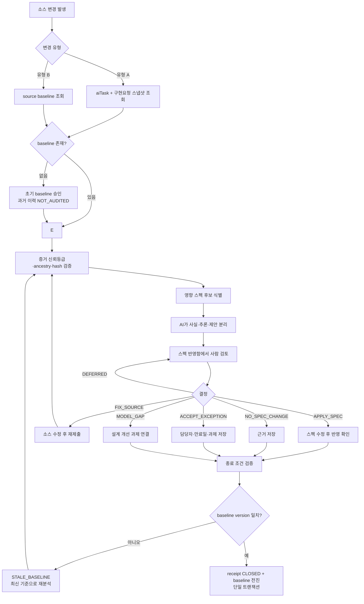
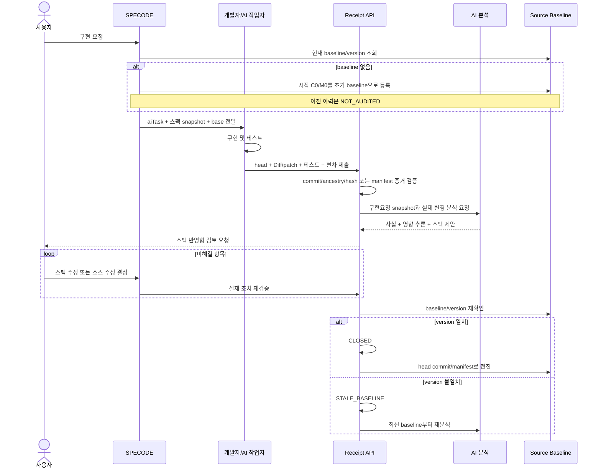
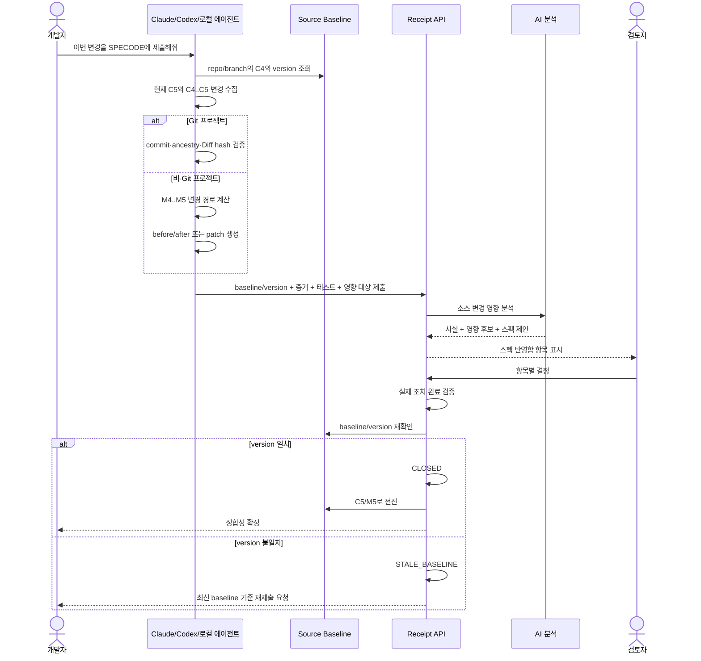

# SPECODE 구현 변경 정합성 설계 요약

> 상태: 설계 요약 — 아직 구현되지 않음  
> 상세 설계: [SPEC_IMPLEMENTATION_RECONCILIATION_PLAN.md](./SPEC_IMPLEMENTATION_RECONCILIATION_PLAN.md)

---

## 1. 한 줄 정의

소스 변경을 제출한다.  
SPECODE가 실제 변경 증거를 분석한다.  
사람이 스펙 반영 여부를 결정한다.  
실제 조치가 끝나면 소스 기준점을 전진시킨다.

```text
소스 변경
  → 변경 증거 제출
  → AI 영향 분석
  → 사람 결정
  → 스펙 또는 소스 조치
  → 조치 재검증
  → 정합성 확정
  → source baseline 전진
```

---

## 2. 해결하는 문제

### 유형 A — 최초 구현이 스펙과 다름

SPECODE가 구현을 요청한다.  
구현 작업자가 스펙과 다르게 만든 부분을 Diff와 함께 제출한다.  
SPECODE가 구현요청 당시 스펙과 실제 구현 결과를 비교한다.

### 유형 B — 구현 완료 후 개발자가 다시 수정함

개발자가 과거 구현 범위를 수정한다.  
SPECODE가 마지막 정합성 확정점 이후의 변경만 수집한다.  
이전의 다른 구현 작업은 다시 섞이지 않는다.

```text
C0 → 1번 구현 C1 → 2번 C2 → 3번 C3 → 4번 C4
                                                ↓
                                  개발자가 1번 범위 수정 C5

비교 범위: C4..C5
C1..C5를 비교하지 않는다.
```

두 유형은 모두 `스펙 반영함`으로 들어간다.

---

## 3. 만드는 것

### `tb_sp_source_baseline`

프로젝트·저장소·브랜치별 마지막 정합성 확정점을 저장한다.

```text
(prjct_id, repo_key, branch_nm)
  → last_reconciled_commit_sha
  또는 last_reconciled_manifest_hash
  → checkpoint_version_no
```

이 값이 다음 유형 B 변경의 유일한 자동 비교 기준이다.

### `tb_sp_impl_receipt`

한 번의 소스 변경 제출을 저장한다.

저장 내용:

- 유형 A/B
- 연결된 AI 태스크
- baseline ID와 제출 당시 version
- base/head commit 또는 manifest
- Diff·patch·테스트 결과
- 증거 신뢰등급과 검증 결과
- 검토 상태와 위험도

receipt가 검토 헤더 역할도 한다. 별도 review header는 만들지 않는다.

### `tb_sp_reconcile_item`

AI가 찾은 변경 후보와 사람의 결정을 저장한다.

```text
확인된 소스 사실
AI가 추론한 영향
스펙 수정 제안
위험도와 확신도
사람의 결정
실제 조치 결과
```

### 스펙 반영함

유형 A와 B receipt를 한 화면에서 검토한다.

---

## 4. source baseline 규칙

1. 기존 프로젝트는 baseline을 한 번 초기화한다.
2. 유형 A 구현요청 시 baseline이 없으면 시작 commit/manifest를 초기 기준점으로 등록한다.
3. 초기화 이전 이력은 `NOT_AUDITED`로 표시한다.
4. 유형 A와 B 모두 receipt를 닫을 때 baseline을 전진시킨다.
5. 1단계 수동 처리와 2단계 자동 적용 모두 같은 규칙을 사용한다.
6. receipt 종료와 baseline 전진은 한 트랜잭션으로 처리한다.
7. 종료 직전에 `baseline_id + checkpoint_version_no`를 다시 확인한다.
8. version이 바뀌었으면 receipt를 닫지 않고 `STALE_BASELINE`으로 전환한다.
9. `PRE_IMPL`은 baseline을 만들거나 전진시킬 수 없다.

```text
receipt base/version == 현재 baseline
  → CLOSED
  → baseline = receipt의 확정 head commit/manifest
  → checkpoint_version_no + 1

receipt base/version != 현재 baseline
  → STALE_BASELINE
  → 최신 baseline부터 재분석
```

---

## 5. 변경 증거 규칙

### Git 프로젝트

```text
PROVIDER_VERIFIED
  서버가 provider에서 commit·ancestry·Diff를 직접 검증

LOCAL_AGENT_ATTESTED
  로컬 에이전트가 저장소 fingerprint·commit·Diff hash를 제출

USER_UPLOADED
  사용자가 patch나 파일을 직접 업로드
```

- base commit이 head commit의 조상인지 확인한다.
- Diff hash가 수집 시점과 분석 시점에 같은지 확인한다.
- `USER_UPLOADED`는 자동 확정 근거로 사용하지 않는다.
- force-push 또는 갈라진 계보는 일반 비교를 중단한다.

### 비-Git 프로젝트

manifest가 변경된 파일을 찾는다.

```text
SOURCE_MANIFEST
  파일 경로
  SHA-256
  선택적 심볼 목록
```

AI는 hash만 분석하지 않는다. 변경된 실제 내용을 receipt에 추가한다.

```text
M4..M5로 변경 경로 확인
  → 변경 파일의 before/after 또는 정규화된 patch 생성
  → tb_cm_attach_file에 receipt 증거로 첨부
  → 첨부 내용의 hash 검증
  → AI 분석
```

이전 파일 내용이 없으면 자동 의미 비교를 하지 않는다. 사용자가 before/after 파일을
제출하거나 현재 snapshot을 새 초기 baseline으로 승인해야 한다.

### 공통 보안

- `.env`, 토큰, 인증서, 비밀 파일을 제외한다.
- vendor, build 결과물, 생성 파일을 기본 제외한다.
- Diff와 첨부 파일에 민감정보 검사를 수행한다.

---

## 6. 영향받은 스펙을 찾는 방법

### 1단계

유형 A는 `ai_task_id + tb_sp_impl_snapshot`으로 대상을 찾는다.  
유형 B는 제출자가 관련 단위업무·화면·영역·기능을 선택한다.  
AI가 파일·심볼·API·테이블을 보고 추가 후보를 제안한다.

영속 스펙-소스 연결지도는 요구하지 않는다.

### 3단계

실제 제출 결과가 쌓이면 `tb_sp_spec_source_link`를 만든다.  
단위업무·화면·영역·기능과 파일·심볼·API·테이블을 N:M으로 연결한다.

---

## 7. AI 분석 결과

AI는 다음 세 가지를 섞지 않는다.

```text
사실:
DELETE API의 권한 검사가 project.delete로 변경됐다.

추론:
MEMBER가 수행하던 삭제가 OWNER 전용으로 바뀔 가능성이 있다.

제안:
기능 설명의 삭제 권한을 OWNER 전용으로 변경한다.
```

근거가 부족하면 `UNKNOWN`으로 남긴다.  
AI 판단만으로 스펙을 수정하지 않는다.

---

## 8. 사람이 선택하는 액션

| 액션 | 실행 | 완료 조건 |
|---|---|---|
| `APPLY_SPEC` | 스펙 수정 | 수정된 필드와 설계 변경 이력을 재검증 |
| `FIX_SOURCE` | 소스 수정 요청 | 수정 commit/manifest를 다시 분석 |
| `NO_SPEC_CHANGE` | 스펙 영향 없음 처리 | 판단 근거 저장 |
| `ACCEPT_EXCEPTION` | 임시 예외 승인 | 사유·담당자·만료일·후속 과제 저장 |
| `MODEL_GAP` | 설계 모델 보완 | 리뷰 또는 설계 개선 과제 연결 |
| `DEFERRED` | 판단 보류 | 미해결 상태 유지, receipt 종료 금지 |

---

## 9. receipt 종료 조건

다음을 모두 만족하면 `CLOSED`로 전환한다.

1. 중요 항목의 결정이 끝났다.
2. `APPLY_SPEC`가 실제 스펙에 반영됐다.
3. `FIX_SOURCE`의 수정 결과를 다시 검증했다.
4. 임시 예외에 담당자와 만료일이 있다.
5. `MODEL_GAP`에 후속 과제가 연결됐다.
6. 확정할 commit 또는 manifest가 있다.
7. 증거 검증 결과가 저장됐다.
8. 현재 baseline version이 제출 당시와 같다.

`CLOSED` 전환과 baseline 전진은 유형 A/B 모두 같은 트랜잭션에서 실행한다.

---

## 10. `PRE_IMPL` 처리

`PRE_IMPL`은 기존 구현요청 스냅샷만 갱신한다.

화면에는 다음처럼 표시한다.

```text
선 구현 적용(소스 검증 없음)
```

규칙:

- receipt를 만들지 않는다.
- 소스 증거를 검증하지 않는다.
- 미해결 정합성 경고를 닫지 않는다.
- source baseline을 전진시키지 않는다.
- 권장 동작은 `소스 변경 제출`이다.

---

## 11. 전체 액션 다이어그램



---

## 12. 유형 A 시퀀스



---

## 13. 유형 B 시퀀스



---

## 14. 구현 단계

### 0단계

실제 변경 5~10건을 MD/JSON으로 shadow 검증한다.  
누락률·오탐률·판단 시간을 측정한다.  
운영 스펙과 DB는 자동 수정하지 않는다.

### 1단계

세 테이블과 수동 제출 UI를 만든다.

```text
tb_sp_source_baseline
tb_sp_impl_receipt
tb_sp_reconcile_item
```

스펙은 기존 화면에서 사람이 수정한다.  
`반영 확인`이 실제 변경을 검증한다.  
검증이 끝나면 유형 A/B 모두 baseline을 전진시킨다.

### 2단계

승인된 `APPLY_SPEC`를 트랜잭션으로 자동 적용한다.  
`before_hash`로 동시 수정을 방지한다.  
`tb_ds_design_change`와 연결한다.

### 3단계

스펙-소스 연결지도를 만든다.  
파일·심볼·API·테이블 관계를 축적한다.

### 4단계

GitHub/GitLab·PR·CI를 연동한다.  
미제출 변경 경고와 선택적 merge/배포 게이트를 추가한다.

---

## 15. 최소 API와 MCP

### API

```text
/source-baselines
/impl-receipts
/impl-receipts/{receiptId}/analyze
/spec-reconciliations
/spec-reconciliations/{receiptId}/items/{itemId}/decision
/spec-reconciliations/{receiptId}/items/{itemId}/confirm-resolution
/spec-reconciliations/{receiptId}/verify
```

### MCP

```text
submit_implementation_receipt
submit_maintenance_change
get_reconciliation
confirm_reconciliation_resolution
```

개발자의 최종 사용 문장은 하나다.

> 이번 변경을 SPECODE에 제출하고 스펙 반영 후보를 만들어줘.

---

## 16. 권한

- 조회: VIEWER 이상
- 제출: MEMBER 이상
- 일반 판단: 담당자 또는 PM/PL/OWNER/ADMIN
- 중요 변경 승인: PM/PL/OWNER/ADMIN
- 권한·삭제·보안·API 파괴 예외: OWNER/ADMIN
- 지원 세션: 조회만 허용

---

## 17. 완료 결과

이 기능을 만들면:

- 최초 구현 편차가 구현 완료 시점에 SPECODE로 돌아온다.
- 개발자의 후속 수정이 마지막 확정점 이후 변경으로 접수된다.
- 1→2→3→4 구현 후 1번을 수정해도 2·3·4가 다시 섞이지 않는다.
- 소스 사실과 AI 추론이 분리된다.
- 승인되지 않은 소스가 스펙을 덮어쓰지 않는다.
- 실제 스펙/소스 조치가 끝나야 receipt가 닫힌다.
- 다음 변경은 갱신된 baseline부터 비교한다.
